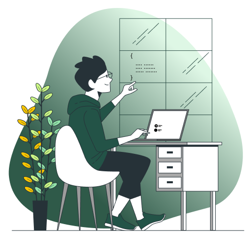

<div align="center"></div>


Let’s dive into my story...

```json

  {
    "name":"Aritra Paul",
    "country":"Bharat",
    "email":"aritrapaulpc@gmail.com"
    "expertise":["Javascript", "TypeScript", "React.js", "Next.js", "Node.js", "MongoDB", "PostgreSQL", "Python"],
    "careerGoals": "To build impactful, user-focused applications",
    "some projects": [
        {
          "name":"JobNest",
          "desc":"A job portal build using MERN stack"
          "uri":"https://github.com/Aritra212/JobNest.git"
        },
        {
          "name":"Hospital Management System",
          "desc":"The application was build using Python & SQLite3",
          "uri":"https://github.com/Aritra212/Hospital-Management-System.git"
        }
    ]
  }

```
<br/>
<br/>
<br/>
<br/>

 

<br/>
<br/>
<p align="center"><b>Thank you</b> for visiting my profile 🙏🏼<br/> I'd love to hear your feedback. Feel free to connect with me.</p>
<h6 align="center">email: aritrapaulpc@gmail.com<br/>linkedin: linkedin.com/in/aritra212<br/><br/></h6>


<div align="center"></div><br/>
<div align="center"></div>

<!---->
